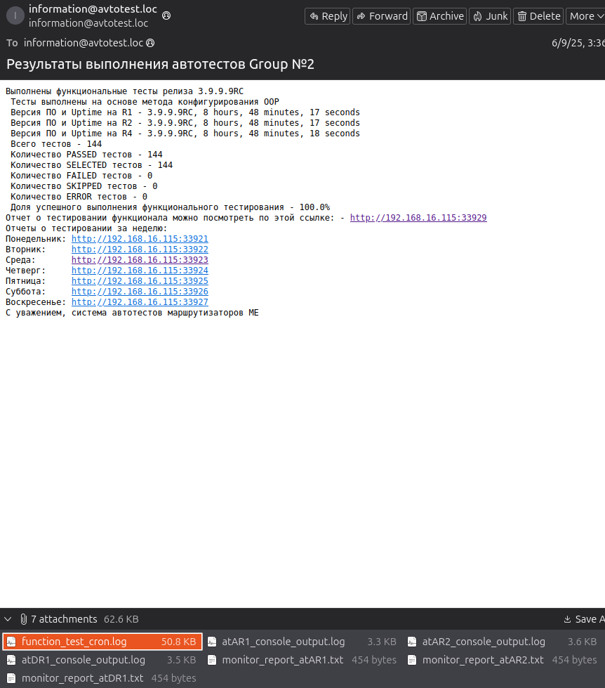
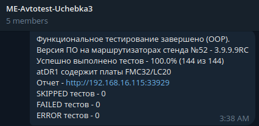
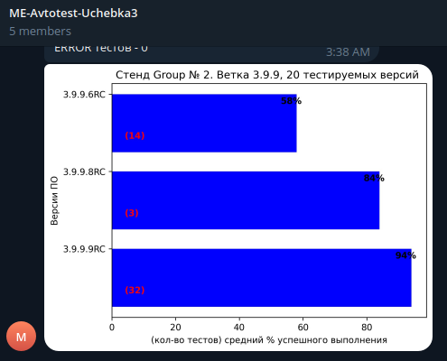

# Автоматическая настройка и тестирование магистальных маршрутизаторов
Данный репозиторий создан для автоматического конфигурирования, тестирования, сохранения результатов и отчётности для маршрутизаторов магистрального уровня.
## Автоматическое конфигурирование
Находится в директории ./configs
Файлы: config_jun.py и config_mes.py файлы для настройки вспомогательных устройств
Основной файл config_me.py и вся директория method_me, где находятся менеджеры настройки функций магистрального маршрутизатора
## Автоматическое тестирование 
Стабилизированные тесты находятся в сабмодуле ./function_autotests
Не стабильные версии тестов находятся в ./function_tests
./conftest.py - Файл для инициализации всех функций и перменных, используемых в тестировании
## Автоматическое сохранение результатов
Сохранение срабатывает в файле ./parse_function_tests_result_textfsm.py, в котором сначала парсится результат пройденных тестов, затем записывается в базу данных mysql
## Автоматическая отчётность
smtp_send.py - Отправляет результат тестирования на локальную почту, пример:

telegramm_send.py - Отправляет результат тестирование в рабочий чат телеграма, пример:

hist_plotting_soft_version_branch.py - Создание гистограммы о результатах тестирования определённой версии и отправление в рабочий чат телеграма, пример:

В директории ./new_result находятся файлы для генерации allure отчёта
Скрипты ./start_serve.sh ./stop_allure.sh ./copy_in_back.sh нужны для генерации allure отчётов за последние 7 дней
## Вспомогательные директории и файлы
./network-schemes - Схемы методов тестирования использующиеся в allure-отчётах
./templates - Шаблоны для парсинга
./tests_descriptions - Подробное описание тестов использующиеся в allure-отчётах
./tools - Инструменты для тестирования, например такие как docker
./watchdog_console.py - Файл для просмотра консоли во время тестирования